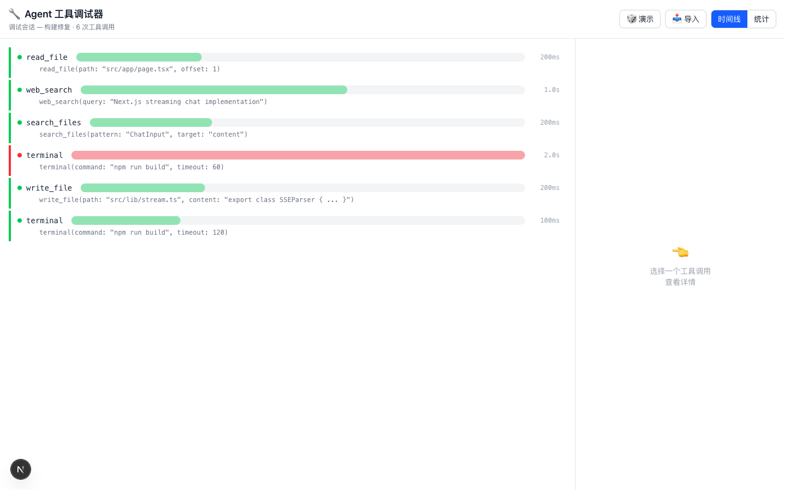

# Agent Tools Playground 🔧

A visual debugger and analyzer for AI agent tool calls. See exactly what tools your agent calls, inspect inputs/outputs, and analyze performance — all in a beautiful timeline view.



## ✨ Features

- **Timeline View** — See every tool call in chronological order with duration bars
- **Detail Inspection** — Click any tool call to see full input/output JSON
- **Diff View** — Compare input vs output to understand transformations
- **Performance Stats** — Success rate, average duration, tool frequency breakdown
- **Demo Mode** — Pre-loaded with realistic agent debugging session data
- **Import/Export** — Import JSON trace data from any agent framework
- **Dark Mode** — System-aware theme

## 🚀 Quick Start

```bash
git clone https://github.com/TeddyBobby/agent-tools-playground.git
cd agent-tools-playground
npm install
npm run dev
```

Open [http://localhost:3000](http://localhost:3000).

## 📊 Use Cases

- **Debug stuck agents** — See which tool call failed and why
- **Optimize performance** — Identify slow tool calls and bottlenecks
- **Understand agent behavior** — Replay tool call sequences step-by-step
- **Share debugging sessions** — Export traces to share with teammates

## 📥 Import Format

The playground accepts JSON arrays of tool trace objects:

```json
[
  {
    "id": "tc-1",
    "name": "read_file",
    "status": "success",
    "input": { "path": "src/app.tsx", "offset": 1 },
    "output": { "content": "export default..." },
    "startTime": 1700000000000,
    "endTime": 1700000000200,
    "duration": 200
  }
]
```

## 🏗️ Tech Stack

| Layer | Technology |
|-------|-----------|
| Framework | Next.js 14 (App Router) |
| Language | TypeScript |
| Styling | Tailwind CSS |
| Visualization | Custom SVG/CSS timeline |
| State | React useState |

## 🤝 Contributing

PRs welcome! Open an issue first for major changes.

## 📄 License

MIT © [TeddyBobby](https://github.com/TeddyBobby)
